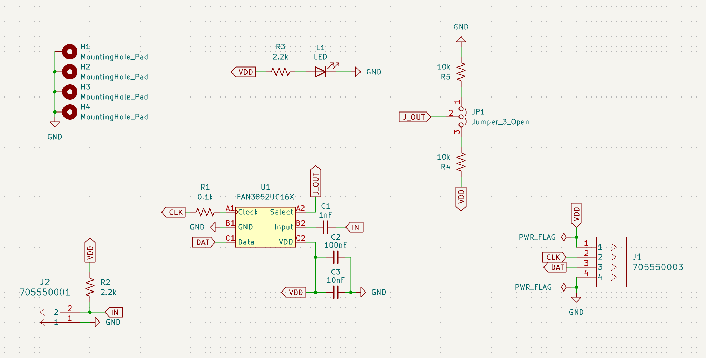
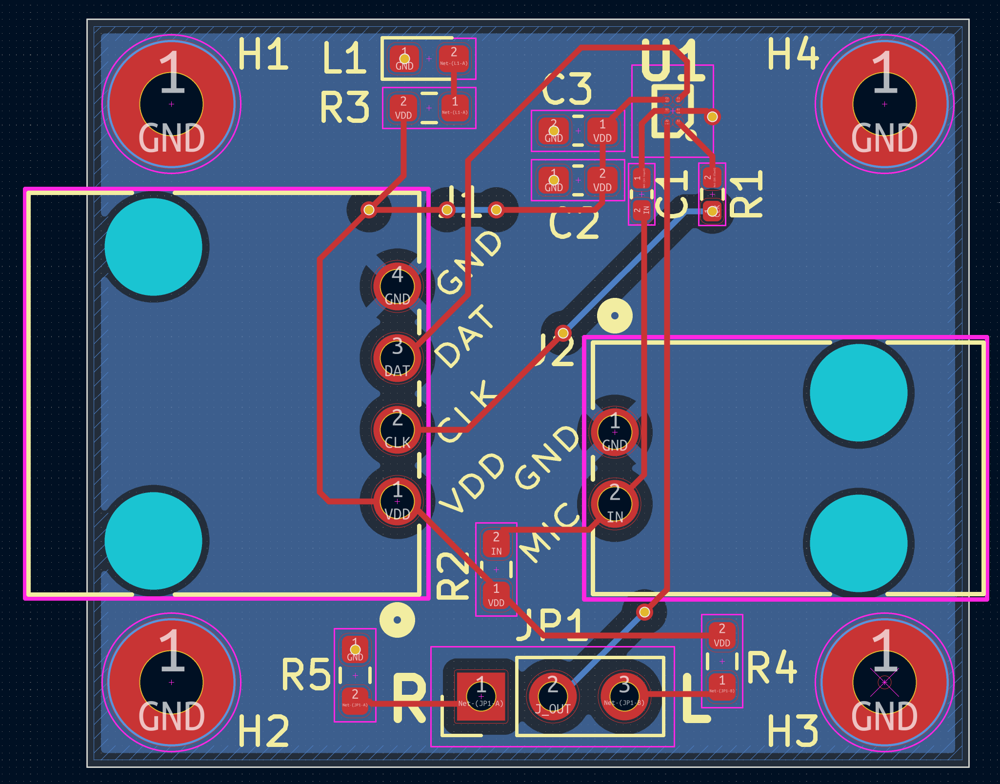

# Electret To PDM

This is a KiCad project that uses a FAN3852 to convert analog electret microphone data to PDM data. It is mounted on a 4-layer PCB, so that a GND plane can be directly below the FAN chip

Additionally, it has grounded mounting pads and a power good LED to see if the connection is working.

## Usage

To be used where there is no better option to turn analog microphone signals into a digital signal. In my case, a Sigma-Delta ADC was used to convert the PDM data into PCM data so that it could more easily be converted into a WAV File for our data collection.

A 1-4 MHz Clock signal should be provided for the FAN Chip to produce PDM data. 

## Connectors
to be a board that uses MOLEX SL 70555 series connectors (4 pin for PDM side and 2 pin for Electret side) to attach the microphone and board

## Schematic

## Layout

There a ground plane on the third layer that runs across the entire board on the third layer, but it was hidden for this image 

